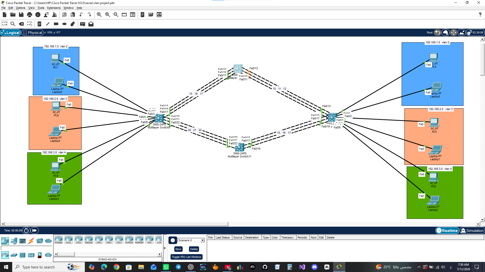
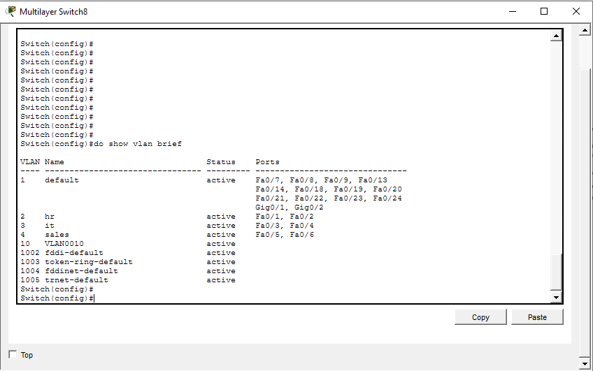
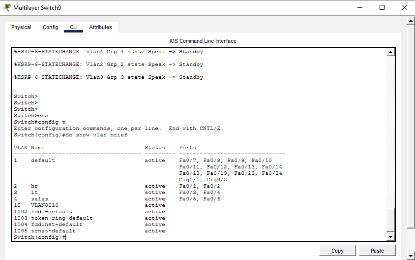
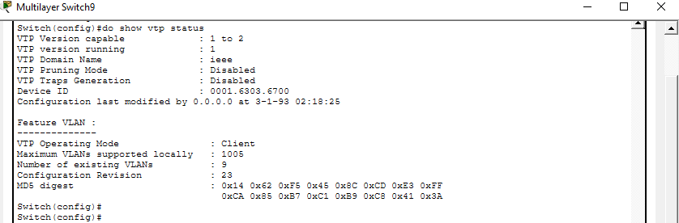
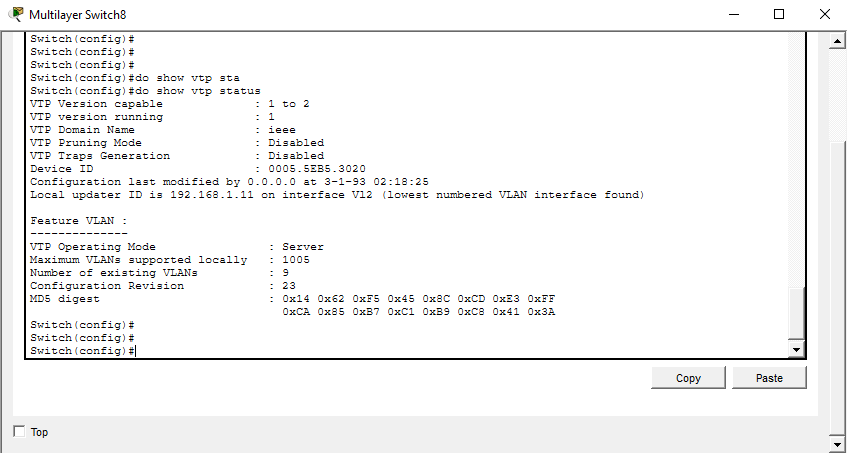
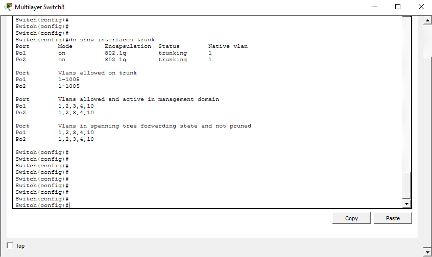
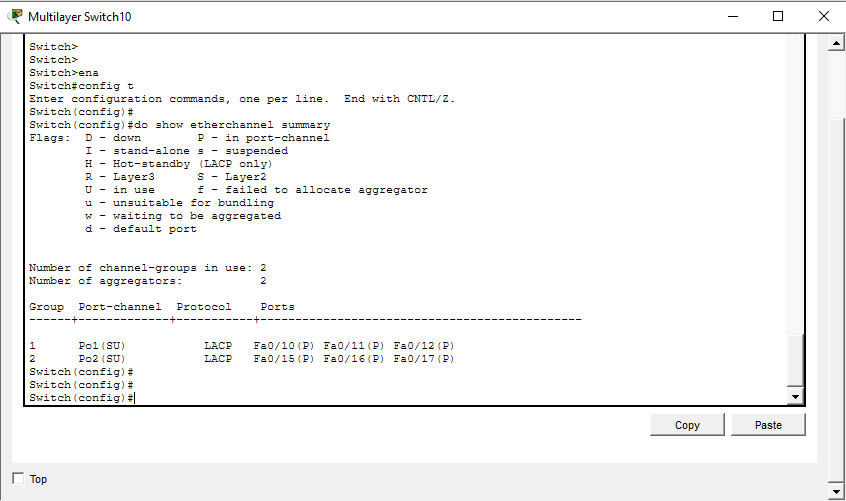
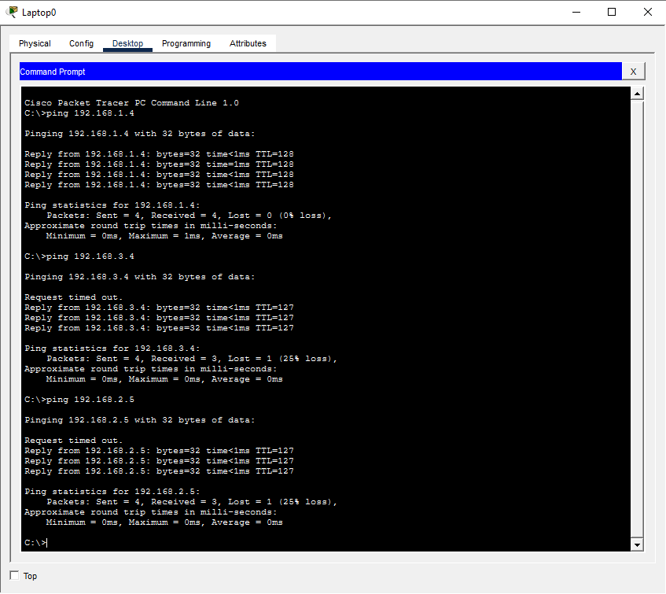
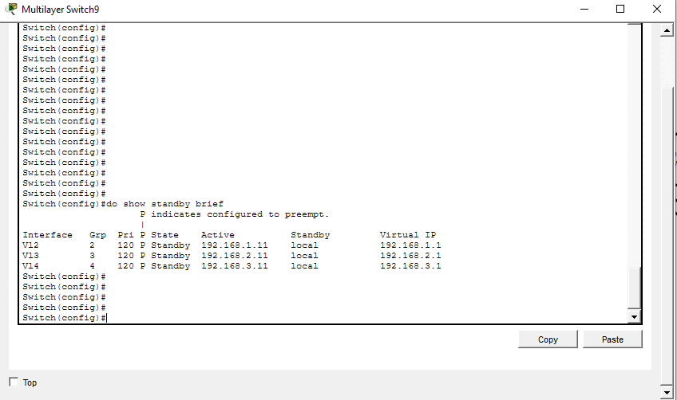
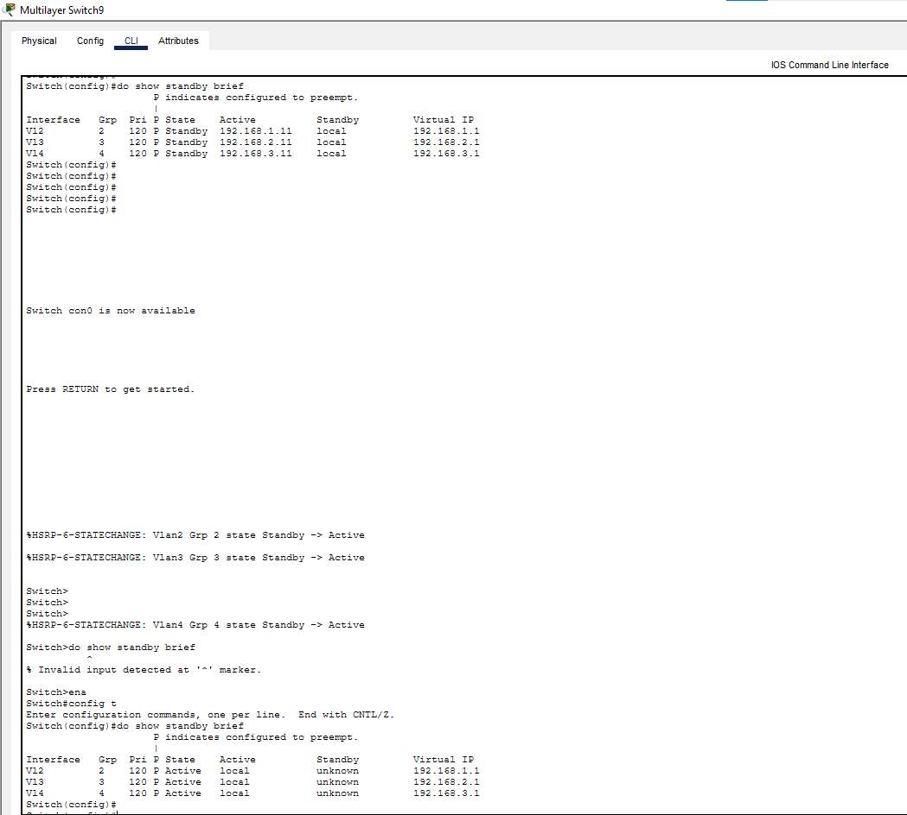

<div align="center">

# 🏢 Enterprise Campus Network

### High Availability • Redundancy • Layer 3 Switching • Cisco Packet Tracer

<p align="center">


</p>

**A production-inspired Enterprise Campus Network implementing Cisco best practices for scalability, high availability, redundancy, and secure Layer 2 / Layer 3 communication.**

---

*"Designing networks isn't about making devices communicate; it's about ensuring they never stop communicating."*

</div>

---

# 🌍 Project Story

Modern enterprises cannot tolerate downtime.

Every department depends on uninterrupted network connectivity to access applications, servers, and business services.

This project was designed to simulate a real enterprise campus network where multiple Cisco technologies work together to deliver:

- High Availability
- Fault Tolerance
- Link Redundancy
- Gateway Redundancy
- Efficient Layer 2 Switching
- Fast Layer 3 Routing

Rather than configuring isolated networking features, this project integrates multiple CCNA technologies into one complete enterprise solution.

---

# 🎯 Objectives

The project aims to achieve the following:

- Build a scalable enterprise campus topology.
- Reduce broadcast domains using VLAN segmentation.
- Simplify VLAN administration with VTP.
- Aggregate multiple physical links using EtherChannel.
- Enable communication between departments using Layer 3 Switching.
- Eliminate the default gateway as a single point of failure using HSRP.
- Provide redundant communication paths between network devices.

---

# 🏗 Enterprise Topology



---

# 🏢 Network Architecture

```

```
                Enterprise Campus Core

          +--------------------------------+
          | Distribution Layer Switch      |
          | HSRP Standby                   |
          +---------------+----------------+
                          ||
                     EtherChannel
                          ||
          +---------------++----------------+
          |                                |
          |                                |
+----------------------+        +----------------------+
| Access Layer Switch  |        | Access Layer Switch  |
| VTP Client           |        | VTP Client           |
+----------------------+        +----------------------+
          |                                |
          +---------------++----------------+
                          ||
                     EtherChannel
                          ||
          +---------------+----------------+
          | Distribution Layer Switch      |
          | HSRP Active                    |
          +--------------------------------+
```

---

# ⚙ Technologies Implemented

| Technology | Purpose | Status |
|------------|---------|--------|
| VLAN | Department Segmentation | ✅ |
| VTP | Centralized VLAN Management | ✅ |
| IEEE 802.1Q | Trunk Links | ✅ |
| EtherChannel | Link Aggregation | ✅ |
| Layer 3 Switching | Inter-VLAN Routing | ✅ |
| HSRP | Gateway Redundancy | ✅ |
| Redundant Design | High Availability | ✅ |

---

# 🌐 VLAN Design

| VLAN | Department | Network |
|------|------------|----------------|
| VLAN 2 | HR | 192.168.1.0/24 |
| VLAN 3 | Sales | 192.168.2.0/24 |
| VLAN 4 | Accounting | 192.168.3.0/24 |

---

# 📷 Configuration Verification

---

## VLAN Configuration

The VLAN database was successfully propagated and verified.





---

## VTP Status

Centralized VLAN management was configured using VTP Server and VTP Client modes.





---

## Trunk Links

IEEE 802.1Q trunks were configured to transport multiple VLANs between switches.



---

## EtherChannel

Multiple physical interfaces were combined into logical links to provide:

- Increased bandwidth
- Redundancy
- Load balancing
- Higher availability



---

## Inter-VLAN Routing

Layer 3 Switching allows hosts in different VLANs to communicate without requiring an external router.



---

## HSRP

Hot Standby Router Protocol was implemented to provide gateway redundancy.

Role Assignment:

| Switch | Role |
|---------|------|
| Right Distribution Switch | Active |
| Left Distribution Switch | Standby |

Clients always use the Virtual IP as their default gateway.

If the Active switch fails, the Standby switch automatically becomes Active.



---

## Redundancy Validation

The network was tested under failure scenarios.

The implemented redundancy mechanisms successfully maintained communication and network availability.



---

# 🧪 Testing Summary

| Test | Result |
|------|--------|
| VLAN Communication | ✅ Passed |
| VTP Synchronization | ✅ Passed |
| Trunk Verification | ✅ Passed |
| EtherChannel Verification | ✅ Passed |
| Inter-VLAN Routing | ✅ Passed |
| HSRP Status | ✅ Passed |
| Network Redundancy | ✅ Passed |

---

# 🎓 Skills Demonstrated

- Enterprise Network Design
- Cisco Switching
- Layer 2 Technologies
- Layer 3 Technologies
- VLAN Segmentation
- VTP Configuration
- EtherChannel Configuration
- HSRP Configuration
- Inter-VLAN Routing
- Network Troubleshooting
- High Availability Design
- Fault Tolerant Network Architecture

---

# 📂 Repository Structure

```
Enterprise-Campus-Network
│
├── Images
│
├── PacketTracer
│   └── Enterprise_Campus_Network.pkt
│
├── README.md
│
└── LICENSE
```

---

# 🚀 Future Enhancements

The current implementation establishes a strong enterprise foundation.

Possible future improvements include:

- OSPF Dynamic Routing
- Rapid PVST+
- DHCP Server Integration
- ACL Security Policies
- SSH Remote Management
- Syslog Server
- NTP Synchronization
- SNMP Monitoring
- Port Security
- DHCP Snooping

---

# 👨‍💻 Author

## Mohamed Amr

**CCNA Certified**

Faculty of Computers and Artificial Intelligence

Cairo University

---

<div align="center">

### ⭐ If you found this project useful, consider giving it a Star.

*"Networks are built with cables, but reliability is built with design."*

</div>
